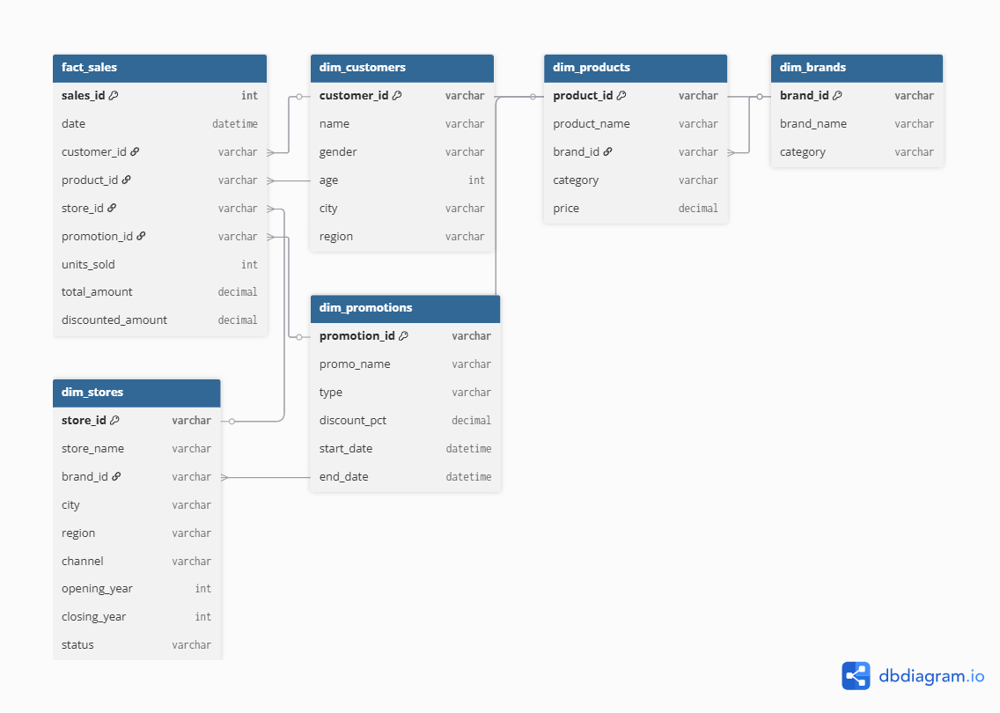

# 🛒 Retail Multi-Brand Data Project

> “This project simulates the analytics challenges of a multi-brand retail holding company.  
> From raw transactional extracts, I built an end-to-end data pipeline → (ingestion → transformation → orchestration → BI dashboard) to generate insights for business stakeholders.”

**Project Highlights**
- Built full pipeline: raw data → DuckDB/dbt marts → BI dashboards.
- Tools: Google Colab, PySpark, DuckDB, dbt, Airflow, Power BI.
- Focus: Data engineering, analytics engineering, business intelligence, and storytelling.

---

## 📌 Project Overview
This project simulates the challenges of working with a **large, messy multi-subsidiary retail dataset**.  
The goal is to showcase technical skills in:
- Data ingestion & cleaning (PySpark, DuckDB)
- Data modeling & transformations (dbt + DuckDB)
- Workflow orchestration (Airflow)
- Visualization & insights (Power BI)
- Business acumen & communication

Deliverables:
- GitHub repo (this one 🖐)
- Interactive Power BI Dashboard
- Analytics & insights presentation deck

---

## ⚙️ Tech Stack
- **Python (pandas, numpy, pyarrow)** – preprocessing & Colab work
- **PySpark** – ingestion & scalable cleaning
- **DuckDB** – embedded analytical database
- **dbt** – transformations, star schema modeling
- **Airflow** – pipeline orchestration (simulated DAGs)
- **Power BI** – dashboard visualization

---

## 🗂️ Repository Structure

<pre>
data/
├── raw/            # Raw CSV extracts (8 source files)
├── staging/        # Cleaned Parquet files after ingestion
└── marts/          # Analytics-ready tables (fact + dims from dbt)

notebooks/          # Colab notebooks (ingestion, EDA, analysis)
dbt_project/        # dbt models (staging, intermediate, marts)
airflow/            # Orchestration DAGs
dashboards/         # Power BI dashboards, exports
presentation/       # Insights deck
docs/               # Schema diagrams, lineage screenshots
</pre>

---

🔄 Data Pipeline Architecture
<pre> 
  Raw CSV extracts 
          ↓ 
  [Ingestion Layer] -> PySpark + DuckDB (staging tables, Parquet export) 
          ↓ 
  [Transformation] -> dbt + DuckDB (star schema: Fact + Dimensions, lineage docs) 
          ↓    
  [Orchestration] -> Airflow DAGs (simulate daily/weekly refresh) 
          ↓ 
  [Analytics Layer] -> Power BI dashboards (KPIs, trends, promos, store insights) 
          ↓ 
  [Business Output] -> Insights deck for executives 
</pre>

---

## 📐 Star Schema

---

📖 [Data Dictionary](docs/data_dictionary.md)

---

## 🛠️ Roadmap

1. **Ingestion** (CSV → DuckDB + Parquet)  
2. **Data Modeling** (star schema design)  
3. **Transformation** (dbt models + lineage)  
4. **Orchestration** (Airflow DAG for pipeline flow)  
5. **Analytics & BI** (Power BI dashboards)  
6. **Insights & Storytelling** (presentation deck)  

---

## 📊 Visuals (Coming Soon)
- ✅ Data model (star schema diagram)  
- ✅ dbt lineage graph  
- ✅ Power BI dashboard screenshots  
- ✅ Final insights deck  

Stay tuned — updates as each phase completes! 🚀

---
