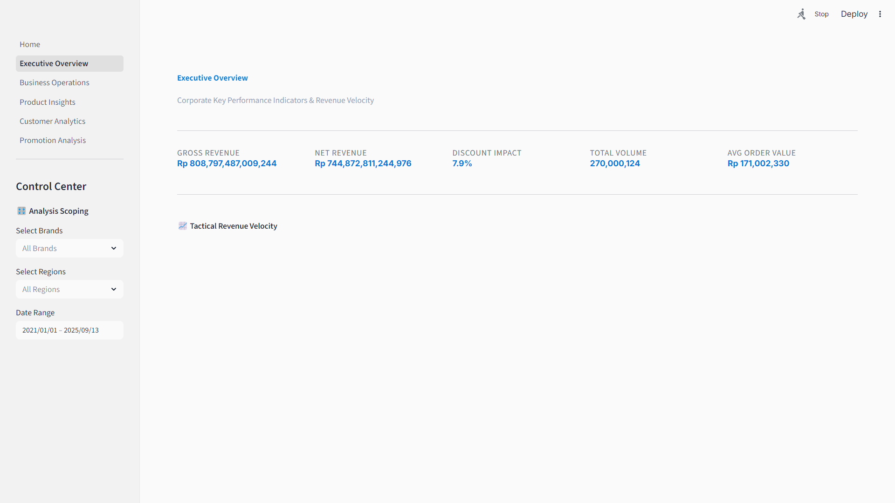
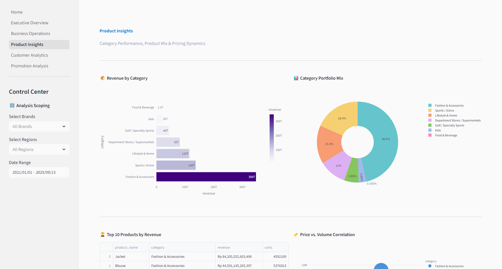
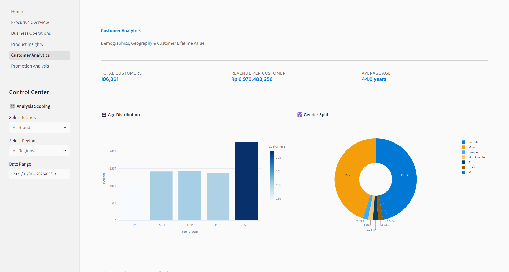
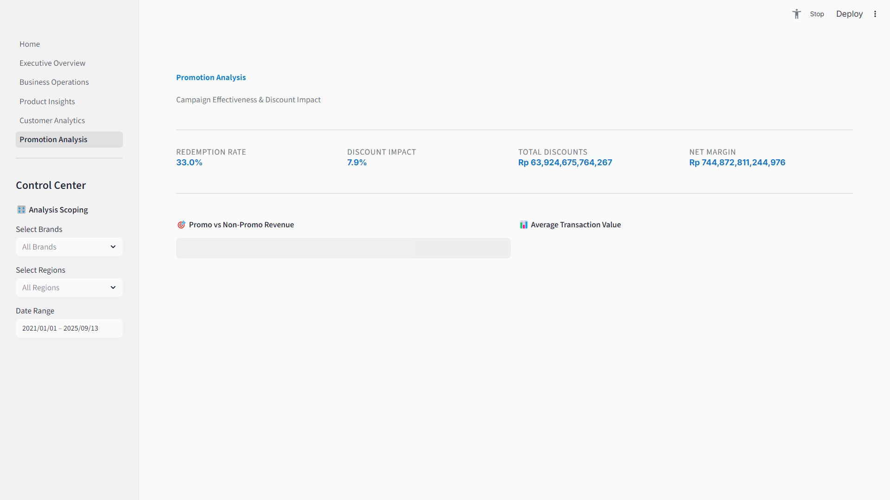

# Retail Multi-Brand Data Project

<div align="center">
  
  
</div>
<div align="center">
  
  
</div>
<br>

> This project simulates the analytics challenges of a multi-brand retail holding company.  
> It covers the end-to-end data lifecycle: ingestion, transformation, orchestration, and BI dashboarding to generate actionable business insights.

## Project Highlights
- **End-to-End Pipeline**: Raw CSV data processed through a DuckDB/dbt warehouse.
- **Data Contracts**: Schema enforcement using Pydantic during ingestion, including a Dead Letter Queue (DLQ) for failed records.
- **Scalable Ingestion**: Support for standard Python batch, Spark for larger loads, and simulated micro-batches.
- **Predictive Analytics**: 90-day sales forecasting using Facebook Prophet.
- **Serving Layer**: A FastAPI layer that pulls from a PostgreSQL production database (Reverse ETL).
- **Automation**: CI/CD via GitHub Actions, testing with Pytest, and SQL linting with SQLfluff.
- **Monitoring**: Automated data quality reports based on dbt test results.
- **IaC**: Terraform configurations representing an AWS deployment environment (S3, RDS, ECS).

---

## Project Overview
This project targets the technical and organizational hurdles of consolidating data from multiple retail subsidiaries.

### Data Strategy
The repository manages the infrastructure and logic. The underlying data is synthetic, designed to mimic common retail messiness (missing values, inconsistent formats, and PII masking requirements). The pipeline is built to handle omnichannel transactions (Online + Offline) to reflect a modern retail environment.

**Objectives:**
- Data ingestion and cleaning (PySpark, DuckDB)
- Star schema modeling (dbt + DuckDB)
- Workflow orchestration (Airflow)
- Professional reporting and business intelligence

---

## Technical Stack
- **Languages**: Python (Pandas, PyArrow), SQL
- **Processing**: PySpark, DuckDB
- **Modeling**: dbt
- **Orchestration**: Apache Airflow (Dockerized)
- **Database**: PostgreSQL (Serving Layer)
- **API**: FastAPI
- **Analytics**: Prophet (Forecasting), Streamlit (Dashboard)
- **DevOps**: Docker, Terraform, GitHub Actions, Pytest

---

## Local Setup
The project uses a **Makefile** to simplify environment management.

1.  **Clone the repository**:
    ```bash
    git clone <repo-url>
    cd retail-multi-brand-data-projects
    ```

2.  **Environment Setup**:
    ```bash
    make setup
    ```

3.  **Manual Setup (Optional)**:
    If you don't have `make` installed, use the provided PowerShell script:
    ```powershell
    .\setup_env.ps1
    ```

---

## Repository Structure

```text
data/
├── raw/            # Source CSV extracts
├── staging/        # Processed Parquet files
└── marts/          # Star schema tables (dbt output)

dbt_project/        # dbt models and tests
airflow/            # Dockerized Airflow DAGs and configs
api/                # FastAPI application
dashboard/          # Streamlit app and Power BI files
scripts/            # Ingestion logic and Pydantic contracts
terraform/          # Infrastructure as Code
tests/              # Pytest suite
```

---

## Data Pipeline Architecture
1.  **Ingestion**: Python/Spark scripts load raw CSVs into DuckDB/Parquet with schema validation.
2.  **Transformation**: dbt builds a Kimball Star Schema (Fact + Dimensions) and runs data quality tests.
3.  **Orchestration**: Airflow DAGs manage the schedule and dependencies between tasks.
4.  **Serving**: Clean data is synced to PostgreSQL and surfaced via a FastAPI REST API.
5.  **Analytics**: Final insights are delivered via a Streamlit dashboard and predictive forecasts.

---

## Documentation
- [**User Manual**](docs/user_manual.md): Detailed setup and operational guide.
- [**Governance Guide**](docs/governance_guidelines.md): Data privacy and PII masking strategy.
- [**API Documentation**](api/README.md): Endpoint reference for the FastAPI serving layer.
- [**Insight Reference**](docs/insight_guidelines.md): Key metrics and analytical patterns.
